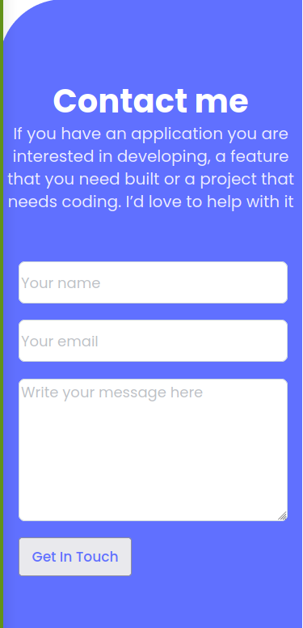

# Project Name

> Portoflio Mobile Website

## Built With

- HTML5 & CSS3

## Live Demo

[Live Demo Link](https://goldinium.github.io/Portfolio_works/)

## Getting Started

To get a local copy up and running

Clone using SSH
git@github.com:Goldinium/Portfolio_works.git

Clone using HTTPS
https://github.com/Goldinium/Portfolio_works.git

## Authors

👤 **Author1**

- GitHub: [@goldinium](https://github.com/goldinium)

👤 **Author2**

- GitHub: [@Fikerte-T](https://github.com/Fikerte-T) 

## 🤝 Contributing

Contributions, issues, and feature requests are welcome!

Feel free to check the [issues page](../../issues/).

## Show your support

Give a ⭐️ if you like this project!

## Acknowledgments

- Hat tip to anyone whose code was used

## 📝 License

This project is [MIT](./MIT.md) licensed.
